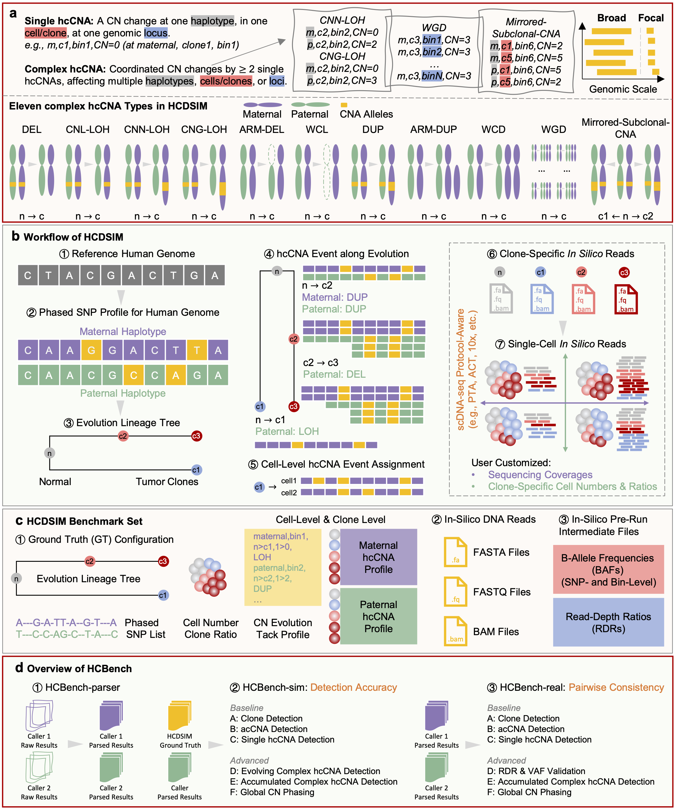

# HCBench

Welcome to the official documentation of HCBench.

## 🗺️ Overview



`hcbench` is organized around three main components:

1. [**HCBench-parser**](https://compbioclub.github.io/HCBench/parsers/): standardizing CNA results from different callers
2. [**HCBench-sim**](https://compbioclub.github.io/HCBench/gtbench/): evaluating detection accuracy against simulated ground truth datasets from HCDSIM
3. [**HCBench-real**](https://compbioclub.github.io/HCBench/realbench/): assessing pairwise consistency between callers using large-scale real-world datasets

## 📦 Installation

```
pip install git+https://github.com/compbioclub/HCBench.git@main
```


## 📌 Citation

If you use HCBench in your research, please cite the following paper:

```

```

